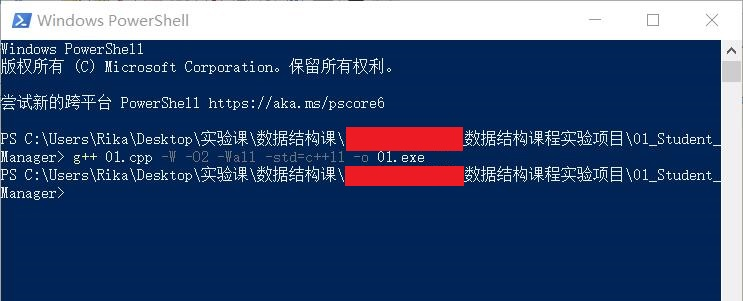
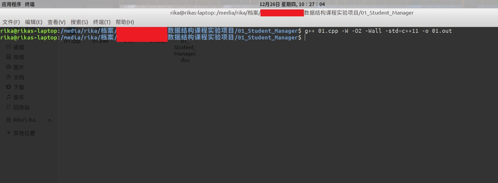

### For Windows: 

All .exe files were compiled in Win10 1909 under the following configurations: 

**g++ [filename] -W -O2 -Wall -std=c++11 -o [Outputfilename]**

For example, to compile the "01_Student_Manager" project, we first change directory to ./01_Student_Manager, then run cmd or powershell under Windows, type in: 

**g++ 01.cpp -W -O2 -Wall -std=c++11 -o 01.exe**

Then we will get the expected .exe file.

---

### For Linux (take Ubuntu 18.04 LTS as an example): 

All .out files were compiled in Ubuntu 18.04 LTS under the following configurations: 

**g++ [filename] -W -O2 -Wall -std=c++11 -o [Outputfilename]**

For example, to compile the "01_Student_Manager" project, we first cd to ./01_Student_Manager, then type in the Terminal as: 

**g++ 01.cpp -W -O2 -Wall -std=c++11 -o 01.out**

Then we will get the expected executable file.

